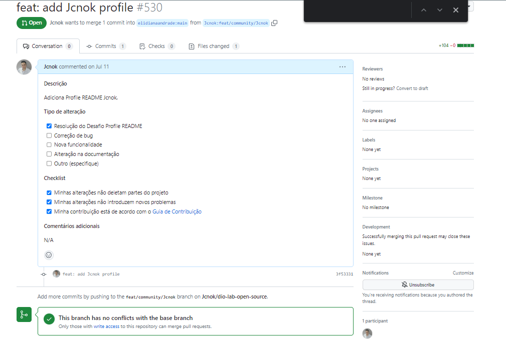

# Desafio: Contribuindo em um Projeto Open Source no Github

## Objetivo :

* **Realizar um fork do repositório: https://github.com/elidianaandrade/dio-lab-open-source**
* **Criar um perfil em markdown e abrir um pull request para branch main do repositório acima.**

## Print da solicitação de pull request.




```python

```
