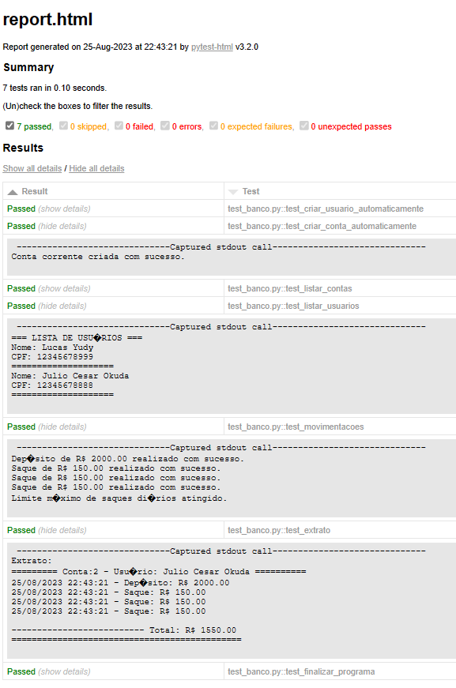

# Desafio - Otimizando o Sistema bancário


<a name="ancora"></a>

# Índice

1. [Apresentação](#ancora1)
2. [Estrutura do Projeto](#ancora2)
3. [Desafios](#ancora3)
4. [Resolução #1](#ancora4)
   - [Documentação](#ancora4.1)
   - [Código Python](#ancora4.2)
5. [Resolução #2](#ancora5)
   - [Novos Requisitos](#ancora5.1)
   - [Documentação](#ancora5.2)
   - [Mapeamento do Diagrama ER](#ancora5.3)
   - [Código Python](#ancora5.4)
   - [Execução](#ancora5.5)
6. [Testes de Integração Automátizados](#ancora6)
   - [Criando uma sequência de testes](#ancora6.1)
   - [Código](#ancora6.2)
   - [Execução](#ancora6.3)
   - [Report(html)](#ancora6.4)
7. [Conclusão](#ancora7) 

<a name="ancora"></a>

<a id="ancora1"></a>

## Apresentação

#### Este projeto é o resultado do meu aprendizado e da minha paixão por explorar novos horizontes. O objetivo principal é demonstrar minhas habilidades práticas e meu comprometimento com a aprendizagem contínua.

#### O projeto se divide em duas resoluções. Na primeira, atendi a todos os requisitos do desafio e acrescentei uma documentação detalhada. Na segunda, fui além, integrando um banco de dados SQLite e implementando testes automatizados de integração com o Pystest, além de adicionar novos requisitos que achei relevante.

#### Toda a jornada foi minuciosamente documentada, transformando-se em um tutorial passo a passo. Meu objetivo é facilitar não apenas a minha vida no futuro, mas também a de outros que desejem explorar esses tópicos.

#### Este projeto é um testemunho do meu compromisso com o aprendizado e minha vontade de compartilhar conhecimento.
[voltar](#ancora)

<a id="ancora2"></a>

## Estrutura de Diretórios:
```
    src/
        ├── desafio_v1.py          # código da solução simples
        │
        ├── banco.py               # código do projeto com banco de dados
        │
        ├── test_banco.py          # código teste de integração com 
        │
        ├── Sistema_bancario.ipynb # Notebook com passo a passo
        │     
        └── database/
            │ 
            └── banco.db         # banco de dados sqlite
```
    
[voltar](#ancora)

<a id="ancora3"></a>

## Desafio:

**Precisamos deixar nosso código mais modularizado, para isso vamos criar funções para as operações existentes: sacar, depositar e visualizar histórico. Além disso, para a versão 2 do nosso sistema precisamos criar duas novas funções: criar usuário(cliente do banco) e criar conta corrente(vincular com usuário).**

### Função de depósito:

* **A função depósito deve receber os argumentos apenas por posição(positional only).**
* **Sugestão de argumentos: saldo, valor, extrato.**
* **Sugestão de retorno: saldo e extrato**.

### Função de saque:

* **A função de saque deve receber os argumentos apenas por nome(keyword only).**
* **Sugestão de argumentos: saldo, valor, extrato, limite, numero_saques, limite_saques.**
* **Sugestão de retorno: saldo e extrato.**

### Função de extrato:

* **A função extrato deve receber os argumentos por posição e nome(positional only e keyword only).**
* **Argumentos posicionais: saldo, argumentos nomeados: extrato**


### Novas funções:

* **Precisamos criar duas novas funções: criar usuário e criar conta corrente.**
* **Fique a vontade para adicionar mais funções, exemplo: listar contas, listar usuários(clientes) etc...**


### Função criar usuário(cliente):

* **O programa deve armazenar os usuários em uma lista, um usuário é composto por: nome, data de nascimento, cpf e endereço.**
* **O endereço é uma string com o formato: logradouro, nro - bairro - cidade/sigla do estado.**
* **Deve ser armazenado somente os números do CPF. Não podemos cadastrar dois usuários com o mesmo CPF.**


### Função criar conta corrente:

* **O programa deve armazenar contas em uma lista, uma conta é composta por: agência, número da conta e usuário**
* **O número da conta é sequencial, iniciando em 1.**
* **O número da agência é fixo:"0001".**
* **O usuário pode ter mais de uma conta, mas uma conta pertence a somente um usuário.**

**Dica:**
    * **Para vincular um usuário a uma conta, filtre a lista de usuários buscando o número do CPF informado para cada usuário da lista.**
    
[voltar](#ancora)

<a id="ancora4"></a>

## Resolução #1

* **Aqui está o resultado que abranje todos os requisitos, incluindo uma explicação detalhada na documentação e o código básico construído com funções.**
* **Mas isso é só o começo!** 
* **Posteriormente irei mergulhar em conceitos mais avançados e criar algo que vá além da superfície e mostre como todas essas peças do quebra-cabeça(bootcamp) se encaixam de uma maneira criativa.**

<a id="ancora4.1"></a>

### Documentação:

**Váriaveis:**

1. **saldo(float)**: Representa o saldo atual da conta bancária.
2. **extrato(list)**: Lista que armazena o histórico de transações da conta bancária.
3. **usuários(list)**:Lista para armazenar os usuários cadastrados.
4. **contas_correntes(list)**:Lista para armazenar as contas correntes cadastradas.
5. **saques_diarios(int)**:variável para armazenar a quantidade de saques realizados em cada dia.
6. **limite_saques(int)**:Variável que define o limite máximo de saques diários.

**Funções:**

1. **cadastrar_usuario(nome, data_nascimento, cpf, endereco)**:Cadastra um novo usuário no sistema.
* **Args**:
    * **nome** (str): Nome do usuário.
    * **data_nascimento** (str): Data de nascimento do usuário.
    * **cpf** (int): Número do CPF do usuário.
    * **endereco** (str): Endereço completo do usuário.
2. **cadastrar_conta_corrente(cpf_usuario)**:Cadastra uma conta corrente vinculada a um usuário.
* **Args**:
    * **cpf_usuario (int)**: Número do CPF do usuário proprietário da conta.
    
3. **deposito(saldo, valor, extrato)**:Realiza um depósito na conta bancária.
* **Args**:
    * **saldo** (float): Saldo atual da conta.
    * **valor** (float): Valor a ser depositado.
    * **extrato** (list): Lista com o histórico de transações.
* **Returns**:
    * **float**: Saldo atualizado.
    * **list**: Extrato atualizado.
4. **saque(*, saldo, valor, extrato, saques_diarios, limite=500, limite_saques=3)**:Realiza um saque na conta bancária.
* **Args**:
    * **saldo** (float): Saldo atual da conta.
    * **valor** (float): Valor a ser sacado.
    * **extrato** (list): Lista com o histórico de transações.
    * **limite** (float, opcional): Limite máximo de saque (padrão é 500).
    * **limite_saques** (int, opcional): Limite máximo de saques diários (padrão é 3).
    * **saques_diarios**(int):Contador do limite diário.
* **Returns**:
    * **float**: Saldo atualizado.
    * **list**: Extrato atualizado.
    * **int**: Contagem de saques.
5. **extrat(saldo, *, extrato)**:Exibe o extrato da conta bancária.
* **Args**:
    * **saldo** (float): Saldo atual da conta.
    * **extrato** (list): Lista com o histórico de transações.
6. **listar_contas()**:Lista as contas correntes cadastradas no sistema.
7. **listar_usuarios()**:Lista os usuários cadastrados no sistema.
8. **exibir_menu()**:Exibe o menu com as opções para o usuário escolher.
9. **main()**:Função principal que executa o programa. Nesta função, o menu é exibido continuamente até que o usuário escolha a opção "q" para sair.

[voltar](#ancora)

<a id="ancora4.2"></a>

### Código python:


```python
import textwrap

saldo = 0
extrato = []
usuarios = []
contas_correntes = []
saques_diarios = 0
limite_saques = 3
limite = 500

def cadastrar_usuario(nome, data_nascimento, cpf, endereco):
    
    # Verifica se o CPF já está cadastrado
    for usuario in usuarios:
        if usuario['cpf'] == cpf:
            print("\n@@@ CPF já cadastrado. Não é possível cadastrar o usuário. @@@")
            return

    # Cria um dicionário com os dados do usuário
    usuario = {
        'cpf': cpf,
        'nome': nome,
        'data_nascimento': data_nascimento,        
        'endereco': endereco
    }

    # Adiciona o usuário à lista de usuários
    usuarios.append(usuario)

    print("\n=== Usuário cadastrado com sucesso! ===")

def cadastrar_conta_corrente(cpf_usuario):
    
    # Verifica se o usuário com o CPF informado existe
    usuario_encontrado = None
    for usuario in usuarios:
        if usuario['cpf'] == cpf_usuario:
            usuario_encontrado = usuario
            break

    if not usuario_encontrado:
        print("\n@@@ Usuário não encontrado. Não é possível cadastrar a conta corrente. @@@")
        return

    # Gera o número da conta sequencialmente
    numero_conta = len(contas_correntes) + 1

    # Cria um dicionário com os dados da conta corrente
    conta_corrente = {
        'agencia': '0001',
        'numero_conta': numero_conta,
        'usuario': usuario_encontrado
    }

    # Adiciona a conta corrente à lista de contas correntes
    contas_correntes.append(conta_corrente)

    print("\n=== Conta corrente cadastrada com sucesso! ===")

def deposito(saldo, valor, extrato):
        
    if valor > 0:
        saldo += valor
        extrato.append(f"Depósito: R$ {valor:.2f}")
        print(f"=== Depósito de R$ {valor:.2f} realizado com sucesso.===")
    else:
        print("\n@@@ Operação falhou! O valor informado é inválido. @@@")

    return saldo, extrato


def saque(*,saldo, valor,saques_diarios, extrato,limite=500, limite_saques=3):
    excedeu_saldo = valor > saldo
    excedeu_limite = valor > limite
    excedeu_saques = saques_diarios >= limite_saques

    if excedeu_saldo:
        print("\n@@@ Operação falhou! Você não tem saldo suficiente. @@@")

    elif excedeu_limite:
        print("\n@@@ Operação falhou! O valor do saque excede o limite. @@@")

    elif excedeu_saques:
        print("\n@@@ Operação falhou! Número máximo de saques excedido. @@@")

    elif valor > 0:        
        saldo -= valor
        extrato.append(f"Saque: R$ {valor:.2f}")
        saques_diarios += 1              
            
        print(f"Saque de R$ {valor:.2f} realizado com sucesso.")
        
    else:
        print(print("\n@@@ Operação falhou! O valor informado é inválido. @@@"))    

    return saldo, extrato, saques_diarios
    

def extrat(saldo, /, *, extrato):
    print("\n================ EXTRATO ================")
    if not extrato:
        print("Não foram realizadas movimentações.")
    else:        
        for movimentacao in extrato:
            print(movimentacao)
        print(f"Saldo atual: R$ {saldo:.2f}")
        print("==========================================")      


def listar_contas():
    
    if not contas_correntes:
        print("\n@@@ Não há contas correntes cadastradas. @@@")
    else:
        print("Contas Correntes:")
        for conta_corrente in contas_correntes:
            numero_conta = conta_corrente['numero_conta']
            agencia = conta_corrente['agencia']
            usuario = conta_corrente['usuario']
            print(f"Conta: {agencia} - {numero_conta} (CPF: {usuario['cpf']}, Nome: {usuario['nome']})")

def listar_usuarios():
    
    if not usuarios:
        print("\n@@@ Não há usuários cadastrados. @@@")
    else:
        print("Usuários:")
        for usuario in usuarios:
            print(f"CPF: {usuario['cpf']}, Nome: {usuario['nome']}")

# Função para exibir o menu
def exibir_menu():
    menu = """\n
    ================ MENU ================    
    [cu]\tCadastrar Usuário
    [lu]\tListar Usuários
    [cc]\tCadastrar Conta Corrente
    [lc]\tListar Contas
    [d ]\tDepositar
    [s ]\tSacar
    [e ]\tExtrato
    [q ]\tSair
    => """
    return input(menu).lower().strip()

# Função Principal

def main():
    while True:
        opcao = exibir_menu()
        global saldo, extrato, saques_diarios
        
        if  opcao == "d":
            valor = float(input("Digite o valor a ser depositado: "))            
            saldo, extrato = deposito(saldo, valor, extrato)
        elif opcao == "s":
            valor = float(input("Digite o valor a ser sacado: "))
            saldo, extrato, saques_diarios = saque(saldo=saldo, valor=valor, extrato=extrato, saques_diarios=saques_diarios)
        elif opcao == "e":
            extrat(saldo, extrato=extrato)
        elif opcao == "lc":
            listar_contas()
        elif opcao == "lu":
            listar_usuarios()
        elif opcao == "cu":
            cpf = int(input("Informe o CPF (somente número): "))
            nome = input("Informe o nome completo: ")
            data_nascimento = input("Informe a data de nascimento (dd-mm-aaaa): ")
            endereco = input("Informe o endereço (logradouro, nro - bairro - cidade/sigla estado): ")
            cadastrar_usuario(nome, data_nascimento, cpf, endereco)
        elif opcao == "cc":
            cpf_usuario = int(input("Digite o CPF do usuário proprietário da conta: "))
            cadastrar_conta_corrente(cpf_usuario)
        elif opcao == "q":
            print("Saindo...")
            break
        else:
            print("Opção inválida. Tente novamente.")
                
if __name__ == "__main__":
    main()    
```

    
    
        ================ MENU ================    
        [cu]	Cadastrar Usuário
        [lu]	Listar Usuários
        [cc]	Cadastrar Conta Corrente
        [lc]	Listar Contas
        [d ]	Depositar
        [s ]	Sacar
        [e ]	Extrato
        [q ]	Sair
        => cu
    Informe o CPF (somente número): 12345678988
    Informe o nome completo: Julio Okuda
    Informe a data de nascimento (dd-mm-aaaa): 11-06-1979
    Informe o endereço (logradouro, nro - bairro - cidade/sigla estado): autódromo, 300 - Interlagos - São Paulo/SP
    
    === Usuário cadastrado com sucesso! ===
    
    
        ================ MENU ================    
        [cu]	Cadastrar Usuário
        [lu]	Listar Usuários
        [cc]	Cadastrar Conta Corrente
        [lc]	Listar Contas
        [d ]	Depositar
        [s ]	Sacar
        [e ]	Extrato
        [q ]	Sair
        => cu
    Informe o CPF (somente número): 12345678988
    Informe o nome completo: Julio Okuda
    Informe a data de nascimento (dd-mm-aaaa): 11-06-19679
    Informe o endereço (logradouro, nro - bairro - cidade/sigla estado): 122223
    
    @@@ CPF já cadastrado. Não é possível cadastrar o usuário. @@@
    
    
        ================ MENU ================    
        [cu]	Cadastrar Usuário
        [lu]	Listar Usuários
        [cc]	Cadastrar Conta Corrente
        [lc]	Listar Contas
        [d ]	Depositar
        [s ]	Sacar
        [e ]	Extrato
        [q ]	Sair
        => lu
    Usuários:
    CPF: 12345678988, Nome: Julio Okuda
    
    
        ================ MENU ================    
        [cu]	Cadastrar Usuário
        [lu]	Listar Usuários
        [cc]	Cadastrar Conta Corrente
        [lc]	Listar Contas
        [d ]	Depositar
        [s ]	Sacar
        [e ]	Extrato
        [q ]	Sair
        => cc
    Digite o CPF do usuário proprietário da conta: 12345678988
    
    === Conta corrente cadastrada com sucesso! ===
    
    
        ================ MENU ================    
        [cu]	Cadastrar Usuário
        [lu]	Listar Usuários
        [cc]	Cadastrar Conta Corrente
        [lc]	Listar Contas
        [d ]	Depositar
        [s ]	Sacar
        [e ]	Extrato
        [q ]	Sair
        => cc
    Digite o CPF do usuário proprietário da conta: 12345678988
    
    === Conta corrente cadastrada com sucesso! ===
    
    
        ================ MENU ================    
        [cu]	Cadastrar Usuário
        [lu]	Listar Usuários
        [cc]	Cadastrar Conta Corrente
        [lc]	Listar Contas
        [d ]	Depositar
        [s ]	Sacar
        [e ]	Extrato
        [q ]	Sair
        => lc
    Contas Correntes:
    Conta: 0001 - 1 (CPF: 12345678988, Nome: Julio Okuda)
    Conta: 0001 - 2 (CPF: 12345678988, Nome: Julio Okuda)
    
    
        ================ MENU ================    
        [cu]	Cadastrar Usuário
        [lu]	Listar Usuários
        [cc]	Cadastrar Conta Corrente
        [lc]	Listar Contas
        [d ]	Depositar
        [s ]	Sacar
        [e ]	Extrato
        [q ]	Sair
        => d
    Digite o valor a ser depositado: 1000
    === Depósito de R$ 1000.00 realizado com sucesso.===
    
    
        ================ MENU ================    
        [cu]	Cadastrar Usuário
        [lu]	Listar Usuários
        [cc]	Cadastrar Conta Corrente
        [lc]	Listar Contas
        [d ]	Depositar
        [s ]	Sacar
        [e ]	Extrato
        [q ]	Sair
        => s
    Digite o valor a ser sacado: 600
    
    @@@ Operação falhou! O valor do saque excede o limite. @@@
    
    
        ================ MENU ================    
        [cu]	Cadastrar Usuário
        [lu]	Listar Usuários
        [cc]	Cadastrar Conta Corrente
        [lc]	Listar Contas
        [d ]	Depositar
        [s ]	Sacar
        [e ]	Extrato
        [q ]	Sair
        => s
    Digite o valor a ser sacado: 100
    Saque de R$ 100.00 realizado com sucesso.
    
    
        ================ MENU ================    
        [cu]	Cadastrar Usuário
        [lu]	Listar Usuários
        [cc]	Cadastrar Conta Corrente
        [lc]	Listar Contas
        [d ]	Depositar
        [s ]	Sacar
        [e ]	Extrato
        [q ]	Sair
        => s
    Digite o valor a ser sacado: 100
    Saque de R$ 100.00 realizado com sucesso.
    
    
        ================ MENU ================    
        [cu]	Cadastrar Usuário
        [lu]	Listar Usuários
        [cc]	Cadastrar Conta Corrente
        [lc]	Listar Contas
        [d ]	Depositar
        [s ]	Sacar
        [e ]	Extrato
        [q ]	Sair
        => s
    Digite o valor a ser sacado: 100
    Saque de R$ 100.00 realizado com sucesso.
    
    
        ================ MENU ================    
        [cu]	Cadastrar Usuário
        [lu]	Listar Usuários
        [cc]	Cadastrar Conta Corrente
        [lc]	Listar Contas
        [d ]	Depositar
        [s ]	Sacar
        [e ]	Extrato
        [q ]	Sair
        => s
    Digite o valor a ser sacado: 100
    
    @@@ Operação falhou! Número máximo de saques excedido. @@@
    
    
        ================ MENU ================    
        [cu]	Cadastrar Usuário
        [lu]	Listar Usuários
        [cc]	Cadastrar Conta Corrente
        [lc]	Listar Contas
        [d ]	Depositar
        [s ]	Sacar
        [e ]	Extrato
        [q ]	Sair
        => e
    
    ================ EXTRATO ================
    Depósito: R$ 1000.00
    Saque: R$ 100.00
    Saque: R$ 100.00
    Saque: R$ 100.00
    Saldo atual: R$ 700.00
    ==========================================
    
    
        ================ MENU ================    
        [cu]	Cadastrar Usuário
        [lu]	Listar Usuários
        [cc]	Cadastrar Conta Corrente
        [lc]	Listar Contas
        [d ]	Depositar
        [s ]	Sacar
        [e ]	Extrato
        [q ]	Sair
        => s
    Digite o valor a ser sacado: -200
    
    @@@ Operação falhou! Número máximo de saques excedido. @@@
    
    
        ================ MENU ================    
        [cu]	Cadastrar Usuário
        [lu]	Listar Usuários
        [cc]	Cadastrar Conta Corrente
        [lc]	Listar Contas
        [d ]	Depositar
        [s ]	Sacar
        [e ]	Extrato
        [q ]	Sair
        => q
    Saindo...
    

[voltar](#ancora)

### Bom nesse momento podemos conferir que o código acima atende todos os requisistos do desafio, poderia parar por aqui certo? Não! Nesse momento irei criar o meu próprio desafio e tentar aplicar um pouco do que venho aprendendo até o momento em questão, então vamos colocar em prática.....

<a id="ancora5"></a>

## Resolução #2

### Aprofundando o Projeto Bancário:


* **Considero que podemos elevar ainda mais o nível do nosso projeto bancário, adicionando recursos e funcionalidades que proporcionarão uma experiência mais rica e eficiente para os usuários.**

### Levantamento de requisitos para criar um projeto mais elaborado a partir do desafio:


* Criar um vínculo entre a conta criada e as transações;
* Algo como: o cliente cria a conta e depois ao inserir seu cpf caso possua uma conta ele tem acesso as sua conta corrente para transações;
* Registrar a data e hora das transações no extrato.
* Como temos um módulo de banco de dados, porque não criar um banco de dados para armazenar os registros;
* Criar um sistema para teste automático, pois já estou cansado de ficar inserindo os dados item a item isso irá agilizar os testes.
* utilizar POO ao invéz de somente funções.

<a id="ancora5.1"></a>
### Novos Requisitos: 

1. **Vínculo entre Conta e Transações:**
* Criar um sistema robusto para associar cada conta corrente a suas respectivas transações.
* Ao criar uma conta, registrar um identificador único que será usado para rastrear todas as transações relacionadas a essa conta.
* Isso permitirá que os clientes acessem suas transações de maneira conveniente e segura.

2. **Acesso a Conta Corrente por CPF:**
* Implementar um sistema de autenticação no qual os clientes podem acessar suas contas fornecendo seu CPF.
* Ao fornecer o CPF, o cliente terá acesso seguro à sua conta corrente e histórico de transações.
* Isso elimina a necessidade de inserir repetidamente informações e agiliza a experiência do usuário.

3. **Registro de Data e Hora:**
* Aprimorar o registro de transações no extrato, incluindo a data e hora em que cada transação foi realizada.
* Isso proporcionará uma visão mais precisa e detalhada do histórico financeiro do cliente.

4. **Integração com Banco de Dados:**
* Criar um banco de dados para armazenar de forma segura todas as informações sobre contas, transações e usuários.
* Utilizar SQL para consultas eficientes e garantir a durabilidade dos dados.
* Isso permitirá uma escalabilidade melhor e uma gestão mais robusta dos registros.

5. **Sistema de Testes Automatizados:**
* Desenvolver um sistema de testes automatizados para verificar a funcionalidade do projeto de maneira contínua e eficaz.
* Automatizar a criação de contas, execução de transações e verificação de resultados.
* Isso agilizará os testes e garantirá que o projeto mantenha seu desempenho e qualidade ao longo do tempo.

6. **Abraçando a Orientação a Objetos (POO):**
* Transformar o projeto em um modelo orientado a objetos, com classes que representam contas, usuários, transações, etc.
* Utilizar conceitos como encapsulamento, herança e polimorfismo para criar um código mais modular e expansível.
* Isso facilitará a manutenção e expansão do projeto no futuro.


[voltar](#ancora)

<a id="ancora5.2"></a>
### Documentação:

**Este código implementa um sistema bancário com algumas funcionalidades elaboradas no decorrer do desafio. O sistema permite a criação de usuários, contas correntes, realização de movimentações (depósito e saque) e visualização de extrato. O sistema utiliza o banco de dados SQLite e a biblioteca SQLAlchemy para interagir com o banco de dados.**

1. **Classe Usuario**
    *    Essa classe modela um usuário do sistema bancário. Cada usuário tem um CPF único, nome, data de nascimento e endereço. 
    
2. **Classe ContaCorrente**
    * Essa classe modela uma conta corrente no banco. Cada conta corrente possui um número de conta exclusivo, agência, CPF do titular, saldo, limite de saques diários e histórico de movimentações.  
        
3. **Classe Movimentacao**
    * Essa classe representa uma movimentação de conta corrente, que pode ser um depósito ou um saque. Cada movimentação está associada a um número de conta, um tipo (depósito ou saque), um valor e uma data/hora.

4. **Classe SaqueDiario**
    * Essa classe registra os saques diários feitos em uma conta corrente. Cada registro contém o número da conta, a data e a quantidade de saques realizados no dia.
       
5. **Classe Banco**
    * Essa classe é responsável por gerenciar todas as operações bancárias. Ela se conecta ao banco de dados SQLite e fornece métodos para criar usuários, criar contas correntes, listar contas e usuários, buscar usuários, realizar movimentações e exibir extrato.    

6. **Método criar_usuario**
    * Cria um novo usuário no sistema, solicitando informações como CPF, nome, data de nascimento e endereço. Verifica se o CPF já está cadastrado antes de criar o usuário.

7. **Método criar_conta_corrente**
    * Cria uma nova conta corrente associada a um CPF de usuário. Verifica se o usuário com o CPF fornecido existe antes de criar a conta.

8. **Método listar_contas e listar_usuarios**
    * Exibe listas de contas correntes e usuários, respectivamente, buscando informações diretamente do banco de dados.

9. **Método buscar_usuario**
    * Verifica se o usuário já existe no BD.
    
10. **realizar_movimentacao**
    * Realiza uma movimentação em uma conta corrente (depósito ou saque), atualiza o saldo e registra a movimentação no histórico. Também verifica o limite diário de saques e registra os saques diários.

11. **Método extrato**
    * Exibe o extrato de uma conta corrente, mostrando todas as movimentações (depósitos e saques) e calculando o saldo final.

12. **Método fechar_conexao**
    * Fecha a conexão com o banco de dados.

13. **Funções exibir_menu e exibir_menu_conta**
    * Essas funções exibem menus interativos para o usuário, permitindo que ele selecione opções para realizar diversas operações.

14. **Função main**
    * A função main é o ponto de entrada do programa. Ela cria uma instância da classe Banco e inicia um loop de menu que permite ao usuário realizar várias operações bancárias.    
    
15. **Bibliotecas**
    * **datetime:** Esta biblioteca fornece classes para manipulação de datas e horas. Ela é usada para registrar as datas e horas das movimentações bancárias, bem como para verificar a data atual para o registro de saques diários.
    * **sqlalchemy:** O SQLAlchemy é um toolkit SQL (Structured Query Language) e um mapeador relacional objeto-relacional (ORM) que oferece uma abstração de alto nível para interagir com bancos de dados. Ele é usado para criar as tabelas do banco de dados, definir esquemas de dados e realizar operações de consulta e manipulação.
    * **Column, Integer, String, Float, ForeignKey:** Essas classes são importadas do SQLAlchemy e são usadas para definir as colunas das tabelas do banco de dados. Elas ajudam a definir os tipos de dados que serão armazenados nas tabelas.
    * **sessionmaker:** Esta classe do SQLAlchemy é usada para criar sessões de banco de dados. Uma sessão é usada para executar consultas e manipulações no banco de dados.
    * **declarative_base:** Essa classe do SQLAlchemy é usada para definir classes de modelos que representam as tabelas do banco de dados. Ela fornece uma abstração conveniente para definir as colunas e as relações entre as tabelas.
    


[voltar](#ancora)

<a id="ancora5.3"></a>
### Mapeamento do Diagrama ER:


[voltar](#ancora)

<a id="ancora5.4"></a>
### Código Python:


```python
# Importando bibliotecas necessárias
import datetime
import sqlite3
from sqlalchemy import create_engine, Column, Integer, String, Float, ForeignKey
from sqlalchemy.orm import sessionmaker
from sqlalchemy.ext.declarative import declarative_base

# Declarando a base para criação de classes ORM
Base = declarative_base()

# Definindo a classe de modelo para usuários
class Usuario(Base):
    __tablename__ = 'usuarios'

    cpf = Column(String, primary_key=True)
    nome = Column(String)
    data_nascimento = Column(String)
    endereco = Column(String)

# Definindo a classe de modelo para contas correntes
class ContaCorrente(Base):
    __tablename__ = 'contas_correntes'

    numero_conta = Column(Integer, primary_key=True, autoincrement=True)
    agencia = Column(String, default='0001')  # Agência preenchida automaticamente
    cpf_usuario = Column(String, ForeignKey('usuarios.cpf'))
    saldo = Column(Float)
    limite = Column(Integer)

    # Construtor da classe
    def __init__(self, cpf_usuario, saldo=0, limite=3):
        self.cpf_usuario = cpf_usuario
        self.saldo = saldo
        self.limite = limite
        self.movimentacoes = []

# Definindo a classe de modelo para movimentações
class Movimentacao(Base):
    __tablename__ = 'movimentacoes'

    id = Column(Integer, primary_key=True, autoincrement=True)
    numero_conta = Column(Integer, ForeignKey('contas_correntes.numero_conta'))
    tipo = Column(String)
    valor = Column(Float)
    data_hora = Column(String)

# Definindo a classe de modelo para saques diários
class SaqueDiario(Base):
    __tablename__ = 'saques_diarios'

    id = Column(Integer, primary_key=True, autoincrement=True)
    numero_conta = Column(Integer, ForeignKey('contas_correntes.numero_conta'))
    data = Column(String)
    quantidade = Column(Integer)

# Classe principal do banco
class Banco:
    def __init__(self):
        # Criando conexão com o banco de dados SQLite
        self.engine = create_engine('sqlite:///database/banco.db')
        # Criando as tabelas no banco de dados
        Base.metadata.create_all(self.engine)
        # Criando a sessão para interagir com o banco de dados
        Session = sessionmaker(bind=self.engine)
        self.session = Session()

    # Método para criar um novo usuário
    def criar_usuario(self):
        cpf = input("CPF (11 caracteres): ")
        if len(cpf) != 11:
            print("CPF deve ter 11 caracteres.")
            return

        usuario = self.session.query(Usuario).filter_by(cpf=cpf).first()

        if usuario:
            print("Usuário com esse CPF já existe.")
        else:
            nome = input("Nome completo: ")
            data_nascimento = input("Data de nascimento (dd-mm-aaaa): ")
            endereco = input("Endereço (logradouro, nro - bairro - cidade/sigla do estado): ")
            
            novo_usuario = Usuario(cpf=cpf, nome=nome, data_nascimento=data_nascimento, endereco=endereco)
            self.session.add(novo_usuario)
            self.session.commit()
            print("Usuário cadastrado com sucesso.")

    # Método para criar uma nova conta corrente
    def criar_conta_corrente(self):
        cpf = input("CPF do usuário: ")
        usuario = self.session.query(Usuario).filter_by(cpf=cpf).first()

        if usuario:
            nova_conta = ContaCorrente(cpf_usuario=cpf)
            self.session.add(nova_conta)
            self.session.commit()
            print("Conta corrente criada com sucesso.")
        else:
            print("Usuário não encontrado.")

    # Método para listar todas as contas correntes
    def listar_contas(self):
        contas = self.session.query(ContaCorrente).all()
        print("=== LISTA DE CONTAS ===")
        for conta in contas:
            print(f"Agência: {conta.agencia}")
            print(f"Número da conta: {conta.numero_conta}")
            print(f"CPF do titular: {conta.cpf_usuario}")
            print(f"Saldo: R$ {conta.saldo:.2f}")
            print(f"Limite: {conta.limite} saques diários")
            print("=" * 20)

    # Método para listar todos os usuários
    def listar_usuarios(self):
        usuarios = self.session.query(Usuario).all()
        print("=== LISTA DE USUÁRIOS ===")
        for usuario in usuarios:
            print(f"Nome: {usuario.nome}")
            print(f"CPF: {usuario.cpf}")
            print("=" * 20)

    # Método para buscar um usuário pelo CPF
    def buscar_usuario(self, cpf):
        usuario = self.session.query(Usuario).filter_by(cpf=cpf).first()
        if usuario:
            return usuario
        else:
            return None

    # Método para realizar movimentações (depósito ou saque) em uma conta corrente
    def realizar_movimentacao(self, conta_corrente, tipo, valor):
        if tipo not in ["Depósito", "Saque"]:
            print("Tipo de movimentação inválido.")
            return

        if tipo == "Saque":
            hoje = datetime.date.today()
            saque_diario = self.session.query(SaqueDiario).filter_by(numero_conta=conta_corrente.numero_conta, data=str(hoje)).first()

            if saque_diario:
                if saque_diario.quantidade >= conta_corrente.limite:
                    print("Limite máximo de saques diários atingido.")
                    return
                else:
                    saque_diario.quantidade += 1
            else:
                saque_diario = SaqueDiario(numero_conta=conta_corrente.numero_conta, data=str(hoje), quantidade=1)
                self.session.add(saque_diario)

        movimentacao = Movimentacao(numero_conta=conta_corrente.numero_conta, tipo=tipo, valor=valor, data_hora=str(datetime.datetime.now()))
        if tipo == "Depósito":
            conta_corrente.saldo += valor
        elif tipo == "Saque":
            conta_corrente.saldo -= valor

        self.session.add(movimentacao)
        self.session.commit()
        print(f"{tipo} de R$ {valor:.2f} realizado com sucesso.")

    # Método para visualizar o extrato de uma conta corrente
    def extrato(self, conta_corrente):
        print("Extrato:")
        usuario = self.session.query(Usuario).filter_by(cpf=conta_corrente.cpf_usuario).first()
        print(f"========= Conta:{conta_corrente.numero_conta} - Usuário: {usuario.nome} ==========")

        movimentacoes = self.session.query(Movimentacao).filter_by(numero_conta=conta_corrente.numero_conta).all()
        total = 0

        for movimentacao in movimentacoes:
            data_hora = datetime.datetime.strptime(movimentacao.data_hora, "%Y-%m-%d %H:%M:%S.%f")
            tipo = movimentacao.tipo
            valor = movimentacao.valor
            if tipo == "Depósito":
                total += valor
            elif tipo == "Saque":
                total -= valor

            print(f"{data_hora.strftime('%d/%m/%Y %H:%M:%S')} - {tipo}: R$ {valor:.2f}")

        print(f"\n-------------------------- Total: R$ {total:.2f}")
        print('=' * 45)

    # Método para fechar a conexão com o banco de dados
    def fechar_conexao(self):
        self.session.close()
        print("Sessão encerrada com sucesso!")

# Função para exibir o menu principal
def exibir_menu():
    menu = """
    [1] Criar usuário
    [2] Criar conta corrente
    [3] Listar contas
    [4] Listar usuários
    [5] Acessar conta    
    [q] Sair
    => """
    return input(menu).lower().strip()

# Função para exibir o menu das operações de conta
def exibir_menu_conta():
    menu = """
    [d] Depósito
    [s] Saque
    [e] Extrato       
    [q] Sair
    => """
    return input(menu).lower().strip()

# Função principal para executar o programa
def main():
    banco = Banco()

    while True:
        opcao = exibir_menu()

        if opcao == "1":
            banco.criar_usuario()
        elif opcao == "2":
            banco.criar_conta_corrente()
        elif opcao == "3":
            banco.listar_contas()
        elif opcao == "4":
            banco.listar_usuarios()
        elif opcao == "5":
            cpf = input("CPF do titular da conta: ")
            usuario = banco.buscar_usuario(cpf)

            if not usuario:
                print("Usuário não encontrado.")
                continue

            contas_usuario = banco.session.query(ContaCorrente).filter_by(cpf_usuario=cpf).all()

            if not contas_usuario:
                print("O usuário não possui contas correntes.")
                continue

            print(f"Contas correntes do usuário ({usuario.nome}):")
            for conta in contas_usuario:
                print(f"Agência: {conta.agencia}")
                print(f"Número da conta: {conta.numero_conta}")
                print("=" * 20)

            numero_conta = int(input("Número da conta: "))
            conta_corrente = banco.session.query(ContaCorrente).filter_by(numero_conta=numero_conta).first()

            if conta_corrente and conta_corrente.cpf_usuario == cpf:
                while True:
                    opcao_conta = exibir_menu_conta()

                    if opcao_conta == "d":
                        try:
                            valor = float(input("Digite o valor a ser depositado: "))
                            banco.realizar_movimentacao(conta_corrente, "Depósito", valor)
                        except ValueError:
                            print("Valor inválido. Tente novamente.")

                    elif opcao_conta == "s":
                        try:
                            valor = float(input("Digite o valor a ser sacado: "))
                            banco.realizar_movimentacao(conta_corrente, "Saque", valor)
                        except ValueError:
                            print("Valor inválido. Tente novamente.")

                    elif opcao_conta == "e":                        
                        banco.extrato(conta_corrente)                        

                    elif opcao_conta == "q":
                        break
            else:
                print("Conta corrente não encontrada ou não pertence ao usuário.")        

        elif opcao == "q":
            print("Saindo...")
            banco.fechar_conexao()
            break
        else:
            print("Opção inválida. Tente novamente.")

if __name__ == "__main__":
    main()


```

[voltar](#ancora)

<a id="ancora5.5"></a>
### Execução do código


```python
main()
```

    
        [1] Criar usuário
        [2] Criar conta corrente
        [3] Listar contas
        [4] Listar usuários
        [5] Acessar conta    
        [q] Sair
        => 1
    CPF (11 caracteres): 12345678999
    Nome completo: Lucas Yudy
    Data de nascimento (dd-mm-aaaa): 25-11-2005
    Endereço (logradouro, nro - bairro - cidade/sigla do estado): av. brasil - 1000 - Centro - Ponta Porã/MS
    Usuário cadastrado com sucesso.
    
        [1] Criar usuário
        [2] Criar conta corrente
        [3] Listar contas
        [4] Listar usuários
        [5] Acessar conta    
        [q] Sair
        => 2
    CPF do usuário: 12345678999
    Conta corrente criada com sucesso.
    
        [1] Criar usuário
        [2] Criar conta corrente
        [3] Listar contas
        [4] Listar usuários
        [5] Acessar conta    
        [q] Sair
        => 3
    === LISTA DE CONTAS ===
    Agência: 0001
    Número da conta: 1
    CPF do titular: 12345678999
    Saldo: R$ 0.00
    Limite: 3 saques diários
    ====================
    
        [1] Criar usuário
        [2] Criar conta corrente
        [3] Listar contas
        [4] Listar usuários
        [5] Acessar conta    
        [q] Sair
        => 4
    === LISTA DE USUÁRIOS ===
    Nome: Lucas Yudy
    CPF: 12345678999
    ====================
    
        [1] Criar usuário
        [2] Criar conta corrente
        [3] Listar contas
        [4] Listar usuários
        [5] Acessar conta    
        [q] Sair
        => 5
    CPF do titular da conta: 12345678999
    Contas correntes do usuário (Lucas Yudy):
    Agência: 0001
    Número da conta: 1
    ====================
    Número da conta: 1
    
        [d] Depósito
        [s] Saque
        [e] Extrato       
        [q] Sair
        => d
    Digite o valor a ser depositado: 1000
    Depósito de R$ 1000.00 realizado com sucesso.
    
        [d] Depósito
        [s] Saque
        [e] Extrato       
        [q] Sair
        => s
    Digite o valor a ser sacado: 100
    Saque de R$ 100.00 realizado com sucesso.
    
        [d] Depósito
        [s] Saque
        [e] Extrato       
        [q] Sair
        => e
    Extrato:
    ========= Conta:1 - Usuário: Lucas Yudy ==========
    25/08/2023 22:42:30 - Depósito: R$ 1000.00
    25/08/2023 22:42:35 - Saque: R$ 100.00
    
    -------------------------- Total: R$ 900.00
    =============================================
    
        [d] Depósito
        [s] Saque
        [e] Extrato       
        [q] Sair
        => s
    Digite o valor a ser sacado: s
    Valor inválido. Tente novamente.
    
        [d] Depósito
        [s] Saque
        [e] Extrato       
        [q] Sair
        => q
    
        [1] Criar usuário
        [2] Criar conta corrente
        [3] Listar contas
        [4] Listar usuários
        [5] Acessar conta    
        [q] Sair
        => q
    Saindo...
    Sessão encerrada com sucesso!
    

* **Conforme o resultado, conseguimos realizar com sucesso todos os novos requisitos, mas para chegar nessa solução, acredite já estou na versão 18, primeiramente começei utilizando a lib SqLite para criar as tabelas com os script SQL e funcionou perfeitamente, porém ao pesquisar a biblioteca SQLAlchemy o código ficou mais simplificado e funcional.**
* **Ao realizar alguns testes pude verificar a necessidade de implementar testes de integração automatizados para identificar os erros, pois preencher várias e várias vezes os dados torna o processo lento e cansativo.**
* **Para realizar a automação, utilizei a biblioteca pytest e pytest-html para gerar um report dos resultados.**
* **Abaixo está o código com a solução**:

[voltar](#ancora)

<a id="ancora6"></a>

## Implementando Testes de Integração Automátizados com pytest.

* **Instalação das libs necessárias para executar o script**.
* _Caso alguém se interesse por replicar o código basta remover '#' do código abaixo._


```python
#Necessário para criar o script
# !pip install pytest
#Necessário para gerar um report em html.
# !pip install pytest-html
```

<a id="ancora6.1"></a>
### Criando uma sequência de testes de integração na visão do usuário:

1. crie um usuário;
2. liste o usuário criado;
3. crie uma conta com o usuário;
4. liste as contas criadas;
5. faça um depósito na conta do usuário de 2000 Reais
6. realize 3 saques de 150 Reais,
7. tente realizar um 4 saque e confirme que não será possivel realizá-lo;
8. exiba o extrato;
9. finalize o programa.

[voltar](#ancora)

<a id="ancora6.2"></a>
### Código:


```python
import pytest
import datetime
from banco import Banco, Usuario, ContaCorrente, SaqueDiario
# variáveis globais.
cpf="12345678888"
nome="Julio Cesar Okuda"
data_nascimento = "11-06-1979"
endereco= "Av. autódromo, 400 - Interlagos - São Paulo/SP"
# Crie uma instância do banco
banco = Banco()

def test_criar_usuario_automaticamente(monkeypatch):
    # variáveis
    global cpf, nome, data_nascimento, endereco
    
    # Criação do mock de input para simular a entrada do CPF
    def mock_input(prompt):
        if prompt == "CPF (11 caracteres): ":
            return cpf
        if prompt == "Nome completo: ":
            return nome
        if prompt == "Data de nascimento (dd-mm-aaaa): ":
            return data_nascimento
        if prompt == "Endereço (logradouro, nro - bairro - cidade/sigla do estado): ":
            return endereco
    monkeypatch.setattr("builtins.input", mock_input) 
    
    # Chamada da função criar_usuario    
    banco.criar_usuario()
    
    # Busca o usuário criado no banco
    usuario_criado = banco.buscar_usuario(cpf)
    
    # Verificações
    assert usuario_criado is not None
    assert usuario_criado.cpf == cpf

def test_criar_conta_automaticamente(monkeypatch):
    # Criação do mock de input para simular a entrada do CPF
    global cpf
    def mock_input(prompt):
        if prompt == "CPF do usuário: ":
            return cpf
    monkeypatch.setattr("builtins.input", mock_input)
    
    # Chamada da função criar_conta_corrente
    banco.criar_conta_corrente()      
    
def test_listar_contas():
    # Execute o método para listar as contas
    banco.listar_contas()   

def test_listar_usuarios():
    # Execute o método para listar os usuários
    banco.listar_usuarios()
    
# função para acessar a conta e realizar movimentações
def test_movimentacoes():
    # Consulta SQLAlchemy para buscar o último item de forma descendente.       
    conta_criada = banco.session.query(ContaCorrente).filter_by(cpf_usuario=cpf).order_by(ContaCorrente.numero_conta.desc()).first()    
    numero_conta = conta_criada.numero_conta
    conta_corrente = banco.session.query(ContaCorrente).filter_by(numero_conta=numero_conta).first()
    
    # Realize um depósito de R$ 2000
    valor_deposito = 2000
    banco.realizar_movimentacao(conta_corrente, "Depósito", valor_deposito)   

    # Execute três saques de R$ 150 cada
    valor_saque = 150
    for _ in range(4):
        banco.realizar_movimentacao(conta_corrente, "Saque", valor_saque)
        
def test_extrato():
    # Consulta SQLAlchemy para buscar o último item de forma descendente.
    conta_criada = banco.session.query(ContaCorrente).filter_by(cpf_usuario=cpf).order_by(ContaCorrente.numero_conta.desc()).first()    
    numero_conta = conta_criada.numero_conta    
    conta_corrente = banco.session.query(ContaCorrente).filter_by(numero_conta=numero_conta).first()
    banco.extrato(conta_corrente) 

#Finaliza o programa
def test_finalizar_programa():    
    assert banco.fechar_conexao() is None

if __name__ == "__main__":    
    # Executar o pytest e gerar o relatório HTML
    pytest.main(["-rA", "--html=report.html", "--self-contained-html"])  

```

[voltar](#ancora)

<a id="ancora6.3"></a>
### Execução

* **os códigos foram salvos respectivamente como banco.py e test_banco.py no diretório /src**
* **Agora vamos realizar um teste para verificação**.


```python
# O pytest consegue encontrar e executar todos os scripts que começam com test_*.
# Com a chamada abaixo conseguimos executar vários scripts de uma única vez.
#!pytest
# Nesse caso irei executar apenas um script então posso usar como abaixo:
!python ./test_banco.py
```

    ============================= test session starts =============================
    platform win32 -- Python 3.9.12, pytest-7.1.1, pluggy-1.0.0
    rootdir: E:\meugithub\Potencia_Tech_powered_by_iFood-Ciencias_de_Dados_com_Python\DP3\src
    plugins: anyio-3.5.0, dash-2.6.1, html-3.2.0, metadata-3.0.0
    collected 7 items
    
    test_banco.py .......                                                    [100%]
    
    =================================== PASSES ====================================
    _____________________ test_criar_usuario_automaticamente ______________________
    ---------------------------- Captured stdout call -----------------------------
    Usuário cadastrado com sucesso.
    ______________________ test_criar_conta_automaticamente _______________________
    ---------------------------- Captured stdout call -----------------------------
    Conta corrente criada com sucesso.
    _____________________________ test_listar_contas ______________________________
    ---------------------------- Captured stdout call -----------------------------
    === LISTA DE CONTAS ===
    Agência: 0001
    Número da conta: 1
    CPF do titular: 12345678999
    Saldo: R$ 900.00
    Limite: 3 saques diários
    ====================
    Agência: 0001
    Número da conta: 2
    CPF do titular: 12345678888
    Saldo: R$ 0.00
    Limite: 3 saques diários
    ====================
    ____________________________ test_listar_usuarios _____________________________
    ---------------------------- Captured stdout call -----------------------------
    === LISTA DE USUÁRIOS ===
    Nome: Lucas Yudy
    CPF: 12345678999
    ====================
    Nome: Julio Cesar Okuda
    CPF: 12345678888
    ====================
    _____________________________ test_movimentacoes ______________________________
    ---------------------------- Captured stdout call -----------------------------
    Depósito de R$ 2000.00 realizado com sucesso.
    Saque de R$ 150.00 realizado com sucesso.
    Saque de R$ 150.00 realizado com sucesso.
    Saque de R$ 150.00 realizado com sucesso.
    Limite máximo de saques diários atingido.
    ________________________________ test_extrato _________________________________
    ---------------------------- Captured stdout call -----------------------------
    Extrato:
    ========= Conta:2 - Usuário: Julio Cesar Okuda ==========
    25/08/2023 22:43:21 - Depósito: R$ 2000.00
    25/08/2023 22:43:21 - Saque: R$ 150.00
    25/08/2023 22:43:21 - Saque: R$ 150.00
    25/08/2023 22:43:21 - Saque: R$ 150.00
    
    -------------------------- Total: R$ 1550.00
    =============================================
    ___________________________ test_finalizar_programa ___________________________
    ---------------------------- Captured stdout call -----------------------------
    Sessão encerrada com sucesso!
    - generated html file: file:///E:/meugithub/Potencia_Tech_powered_by_iFood-Ciencias_de_Dados_com_Python/DP3/src/report.html -
    =========================== short test summary info ===========================
    PASSED test_banco.py::test_criar_usuario_automaticamente
    PASSED test_banco.py::test_criar_conta_automaticamente
    PASSED test_banco.py::test_listar_contas
    PASSED test_banco.py::test_listar_usuarios
    PASSED test_banco.py::test_movimentacoes
    PASSED test_banco.py::test_extrato
    PASSED test_banco.py::test_finalizar_programa
    ============================== 7 passed in 0.10s ==============================
    

[voltar](#ancora)

<a id="ancora6.4"></a>
### Report(Html)

**Veja que interessante, o pytest é uma mão na roda rs, ele criou um report em html, vamos abrir o report.html aqui para conferirmos como ficaram os testes em detalhes com um simples código abaixo:**


```python
from IPython.display import IFrame

IFrame(src='report.html', width=900, height=900)
```




* **Como podem ver os testes foram realizados com sucesso.**
* **Observação o pytest é mais utilizado para testes unitários, esse foi apenas uma demonstração como teste de integração simples.**


[voltar](#ancora)

<a id="ancora7"></a>

## Conclusão do projeto

#### Durante o desenvolvimento desse projeto, mergulhei em uma jornada de aprendizado que me levou além do imaginado. Fui motivado a explorar várias alternativas, como implementar um banco de dados com  [SQLite3](https://docs.python.org/3/library/sqlite3.html#module-sqlite3) em conjunto com a [Toolkit ORM SQAlchemy](https://www.sqlalchemy.org/) o código não ficou apenas mais limpo, mas também mais eficiente e prático. Embora tenha começado a jornada com SQL convencional, rapidamente percebi a diferença ao utilizar o SQLAlchemy. Foram horas de estudo, mas cada minuto investido valeram a pena.
    
#### À medida que várias versões do projeto surgiam por volta da versão 18, percebi a necessidade premente de automatizar os testes de integração, pois a cada tentativa e erro surgia a necessidade constante de realizar os testes de requisitos. Com esse objetivo adotei a biblioteca [Pytest](https://docs.pytest.org/en/7.4.x/contents.html) amplamente reconhecia por sua eficácia em testes unitários, porém para o meu caso, caiu como uma luva nos testes de integração que ao instalar a lib [pytest-html](https://pypi.org/project/pytest-html/) fui capaz de criar relatórios em html de forma bem sofisticada.

#### Fiquei totalmente imerso nesse projeto, ao mesmo tempo que me proporcionou uma visão abrangente das complexidades inerentes a qualquer negócio. Aprendi a importância das metodologias ágeis na gestão do tempo e no acompanhamento das fases cruciais para o sucesso de um projeto.

#### Considero este projeto como um ponto de partida para inúmeras possibilidades de expansão, destaco a implantação de uma banco de dados mais robustos, a inserção de dados fictícios para análise e exploração, além de desenvolver uma interface com o [streanlit](https://streamlit.io/) para uma melhor experiência visual. 

#### Não posso deixar de expressar minha gratidão á [DIO](https://www.dio.me/), aos instrutores excepcionais e a todos que, de alguma forma, contribuíram para o meu sucesso por meio do fórum. Esse projeto foi uma experiência enriquecedora que não apenas fortaleceu minhas habilidades, mas também abriu um mundo de possibilidades para o futuro.


[voltar](#ancora)


```python

```
